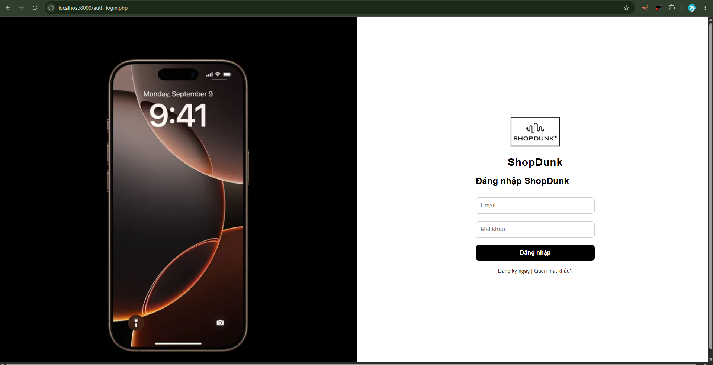
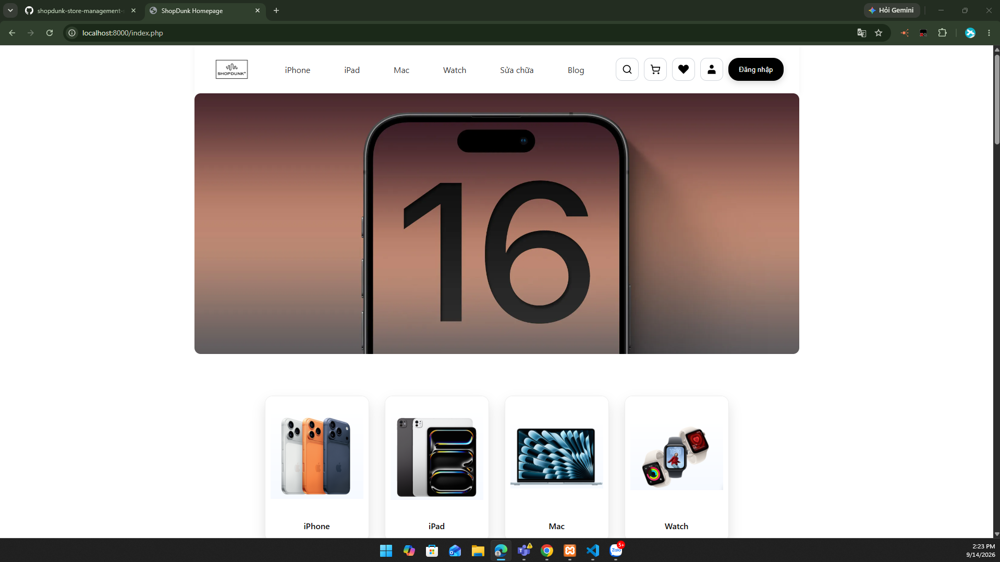
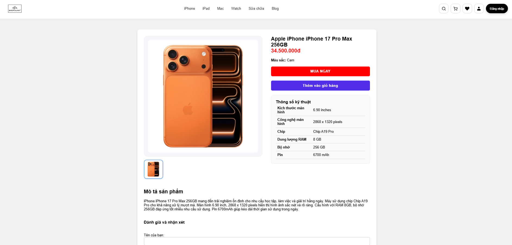
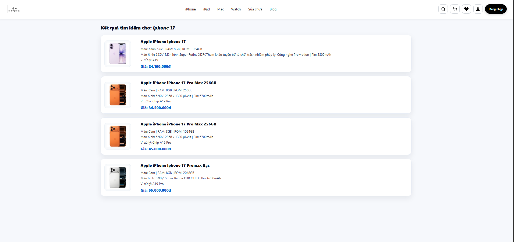
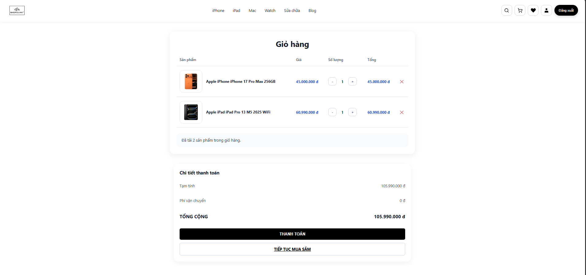
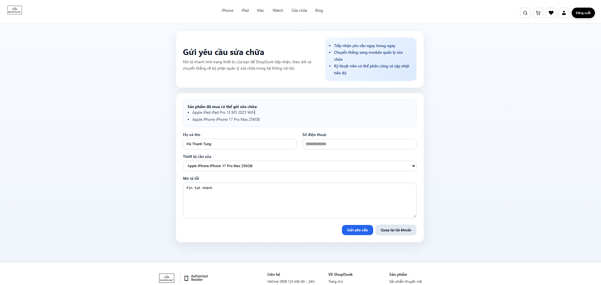
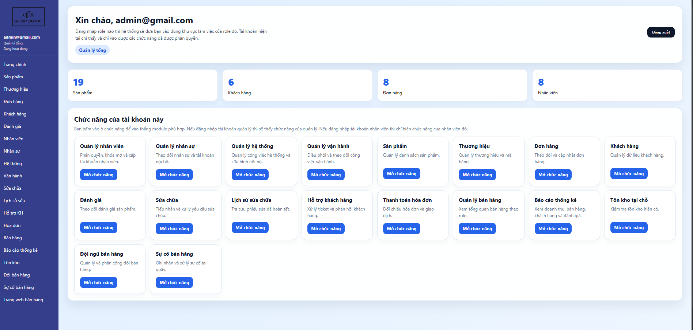

# ShopDunk Store Management System

> Business Analysis • System Analysis • UML • Database Design • Software Testing

A system analysis and design project for managing the business processes of a mobile phone retail store.

The project focuses on requirement analysis, business process modeling, system design, database design, and software testing.

---

## Project Overview

The ShopDunk Store Management System is designed to support the main business processes of a mobile phone retail store.

The system covers:

- User authentication and account management
- Customer management
- Employee management
- Product and brand management
- Supplier management
- Inventory and import management
- Shopping cart management
- Order management
- Invoice creation and sales management
- Payment processing
- Warranty and repair management
- Product reviews
- Product search
- Sales monitoring and reporting

---
## System Demo

### Login


### Home Page


### Product Detail


### Search


### Shopping Cart


### Checkout / Payment


### Repair Request


### Admin Dashboard


## Source Code

The repository includes the source code of the ShopDunk Store Management System.

The implementation demonstrates how the analyzed requirements and system designs are applied to a working application.

### Main Technologies

- PHP
- MySQL
- HTML
- CSS
- JavaScript
- RESTful API
- Git / GitHub

---

## Project Structure

```text
shopdunk-store-management-system/
│
├── src/                 # Application source code
├── screenshots/         # System demo screenshots
├── diagrams/            # UML diagrams
├── docs/
│   └── report/          # BA & system documentation
├── testing/             # Test cases and decision tables
│
└── README.md
## My Focus

Through this project, I participated in system analysis and design activities including:

- Requirement gathering and analysis
- Stakeholder interviews and customer surveys
- Functional and non-functional requirement analysis
- Requirement clarification
- Use Case analysis
- UML system modeling
- Database design
- Test Case and Test Scenario design
- Functional testing
- System documentation

---

## Business Analysis Process

The project followed an analysis and design process:

**Requirement Elicitation → Requirement Analysis → Functional & Non-functional Requirements → Use Case Analysis → UML Modeling → Database Design → Testing**

### Requirement Elicitation

Requirements were collected using:

- Interviews
- Customer surveys
- Business process analysis
- Requirement clarification

### Requirement Analysis

The collected information was analyzed to identify:

- System actors
- Business processes
- Functional requirements
- Non-functional requirements
- System functions
- Data requirements

---

## Key BA Deliverables

The project includes the following Business Analysis and System Analysis artifacts:

| Deliverable | Description |
|---|---|
| Requirement Documentation | Functional and non-functional requirements |
| Requirement Elicitation | Interviews, surveys and requirement clarification |
| Use Case Diagram | System actors and major system functions |
| Activity Diagrams | Business and system process flows |
| Sequence Diagrams | Interaction between actors and system components |
| Class Diagram | Main classes and system structure |
| State Diagrams | Object states and state transitions |
| Database Design | Database tables, attributes, keys and constraints |
| Decision Tables | Testing conditions and expected system behavior |
| Test Cases | Functional testing scenarios and expected results |
| Project Report | Complete analysis and system design documentation |

---

## UML & System Modeling

The project contains UML diagrams used to model system requirements and behavior.

### Use Case Diagram

The Use Case Diagram describes the main actors and functions of the system.

[View Use Case Diagram](diagrams/use-case-overview.png)

### Activity Diagrams

Activity Diagrams describe the workflow of important system functions, including:

- Login
- Cart Management
- Sales Monitoring
- Invoice Creation
- Order Confirmation

[View Activity Diagrams](diagrams/)

### Sequence Diagrams

Sequence Diagrams describe interactions between actors and system components for:

- Login
- Cart Management
- Sales Monitoring
- Invoice Creation
- Order Confirmation

[View Sequence Diagrams](diagrams/)

### Class Diagram

The Class Diagram illustrates the main classes, attributes, relationships, and structure of the system.

[View Class Diagram](diagrams/class-diagram.png)

### State Diagrams

State Diagrams were created for major system entities:

- Supplier
- Account
- Product
- Import Receipt
- Order
- Cart
- Repair Ticket

[View State Diagrams](diagrams/)

---

## Database Design

The project uses **MySQL** for relational data management.

Database documentation includes:

- Database tables
- Attributes
- Data types
- Primary keys
- Foreign keys
- Constraints
- Data descriptions

Main documented tables include:

1. Accounts
2. Admin
3. Blog
4. Brands
5. Cart
6. Customer
7. Mobile
8. Operations_tasks
9. Paymentbill
10. Reviews

[View Database Design](docs/report/database-design.md)

---

## Software Testing

Testing documentation was created for core system functionalities.

### Functions Tested

- Login
- Registration
- Search

### Testing Artifacts

The testing documentation includes:

- Decision Tables
- Test Cases
- Test Scenarios
- Test Data
- Expected Results
- Actual Results
- Pass/Fail Status

[View Testing Documentation](testing/README.md)

---

## Technologies & Tools

| Category | Technologies / Methods |
|---|---|
| Database | MySQL |
| System Modeling | UML |
| Requirements | Requirement Analysis, Functional & Non-functional Requirements |
| Testing | Test Case, Test Scenario, Decision Table, Functional Testing |
| Documentation | Requirement Documentation, System Analysis Documentation |
| Version Control | Git, GitHub |

---

## Project Structure

```text
shopdunk-store-management-system/
│
├── diagrams/
│   ├── use-case-overview.png
│   ├── activity-*.png
│   ├── sequence-*.png
│   ├── class-diagram.png
│   └── state-*.png
│
├── docs/
│   └── report/
│       ├── README.md
│       ├── requirements.md
│       ├── requirement-elicitation.md
│       ├── database-design.md
│       └── ShopDunk_Project_Report.pdf
│
├── testing/
│   ├── README.md
│   ├── decision-table-*.png
│   └── test-case-*.png
│
└── README.md
```

---

## Documentation

Detailed project documentation is available below:

| Documentation | Link |
|---|---|
| System Requirements | [View](docs/report/requirements.md) |
| Requirement Elicitation | [View](docs/report/requirement-elicitation.md) |
| Database Design | [View](docs/report/database-design.md) |
| UML Diagrams | [View](diagrams/) |
| Testing Documentation | [View](testing/README.md) |
| Documentation Index | [View](docs/report/README.md) |
| Full Project Report | [View PDF](docs/report/ShopDunk_Project_Report.pdf) |
| Use Case Specification | [View](docs/report/use-case-specification.md) |
| Business Rules | [View](docs/report/business-rules.md) |
| Stakeholder Analysis | [View](docs/report/stakeholder-analysis.md) |
| Functional Requirements | [View](docs/report/functional-requirements.md) |
| Non-functional Requirements | [View](docs/report/non-functional-requirements.md) |
| System Risks | [View](docs/report/system-risks.md) |
| Future Development | [View](docs/report/future-development.md) |

---

## Project Highlights

This project demonstrates knowledge and practical application of:

- Business requirement analysis
- Requirement elicitation
- Functional and non-functional requirements
- UML modeling
- Business process analysis
- Relational database design
- Software testing
- Test Case design
- Technical documentation
- System analysis and design

---

## Academic Project

This project was developed as part of the **Information Systems Analysis and Design** coursework.

**Major:** Information Systems  
**University:** University of Transport Technology  
**Year:** 2026

The project was developed for academic and learning purposes.
