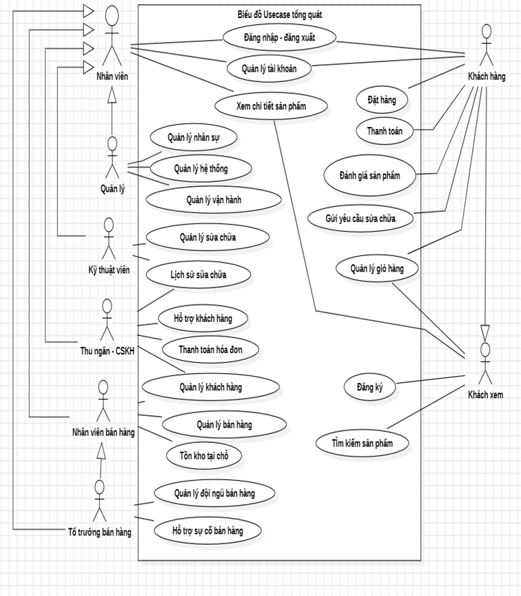
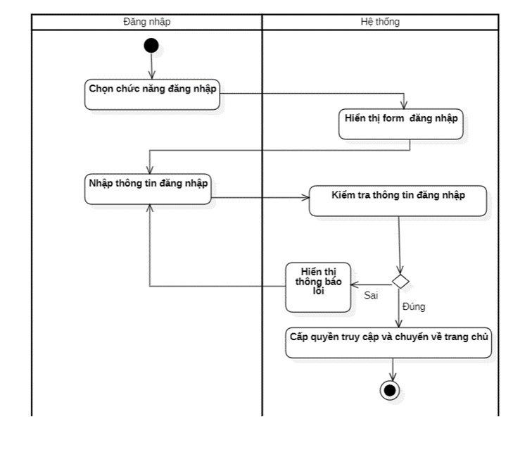
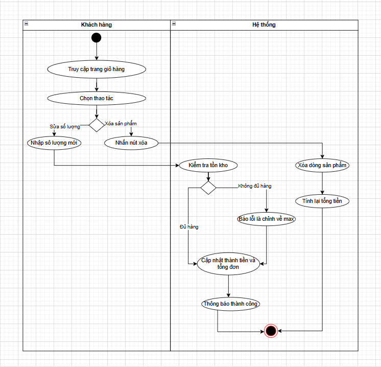
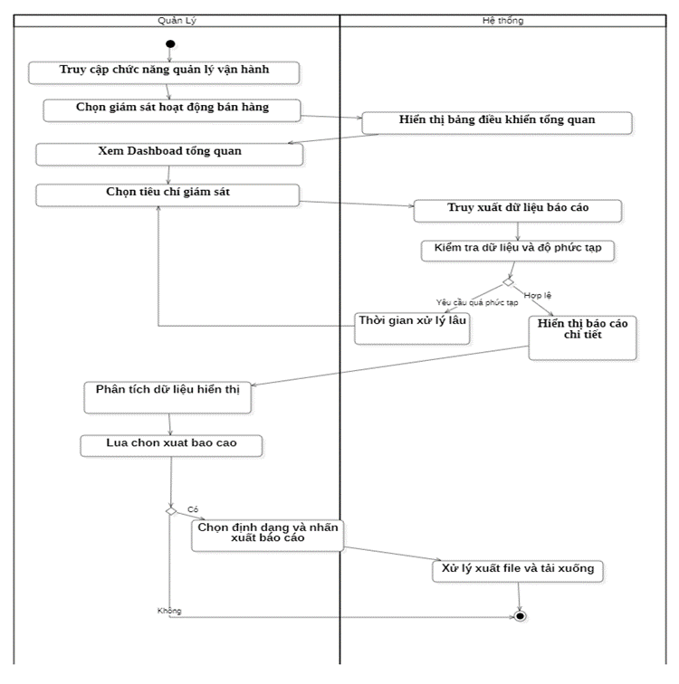
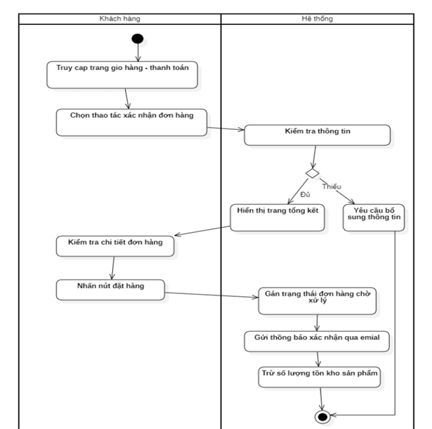
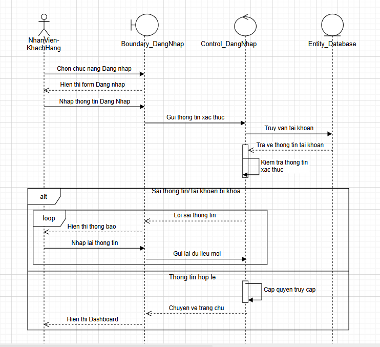
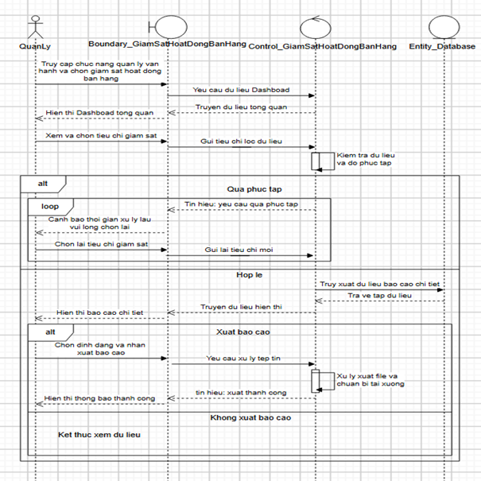
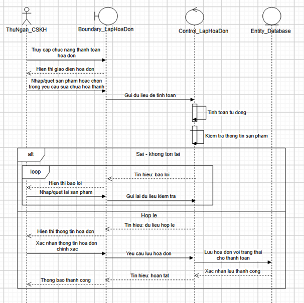

# 📊 UML Diagrams

This folder contains UML diagrams used in the analysis and design of the ShopDunk Store Management System.

## Use Case Diagram

### Overview Use Case Diagram

The diagram below provides an overview of the main actors and system functionalities.

## Activity Diagrams

### Login Activity Diagram

The diagram below illustrates the login process, including credential validation, error handling, and successful access to the system.

### Cart Management Activity Diagram

This diagram illustrates how customers update product quantities, remove items, and how the system validates inventory and recalculates the cart total.

### Sales Monitoring Activity Diagram

This diagram illustrates the process of monitoring sales performance through dashboard data, KPIs, sales reports, and business indicators.

### Order Confirmation Activity Diagram

This diagram illustrates the order confirmation process, including order review, payment information verification, inventory update, and order status processing.

## Sequence Diagrams

### Login Sequence Diagram

This diagram illustrates the interaction between the user and system components during the login process.

### Sales Monitoring Sequence Diagram

This diagram illustrates the interactions between system components during the sales monitoring process, including data retrieval, KPI analysis, and report display.

### Invoice Creation Sequence Diagram

This diagram illustrates the interaction between system components during the invoice creation process.

