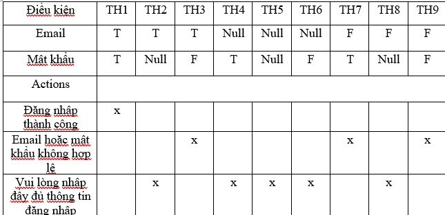
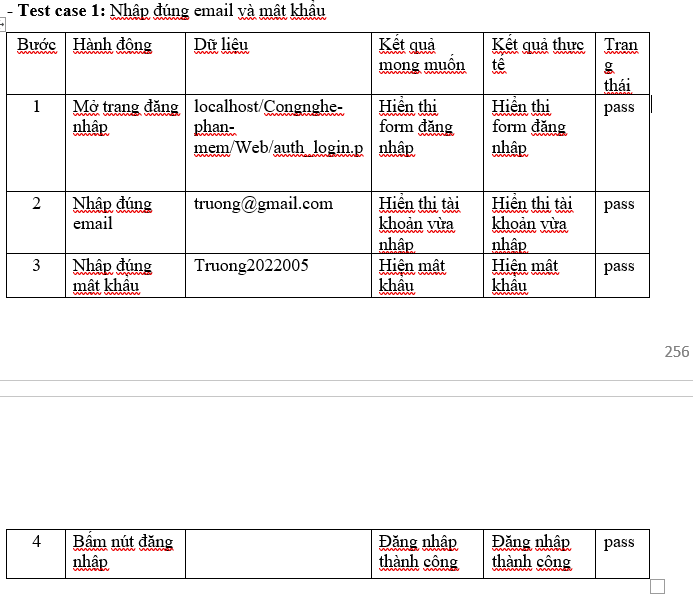
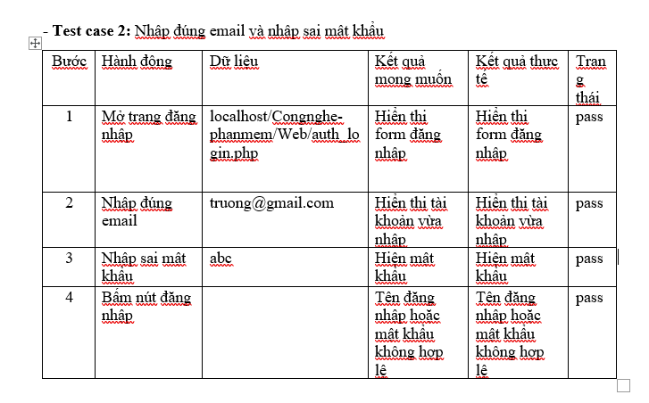
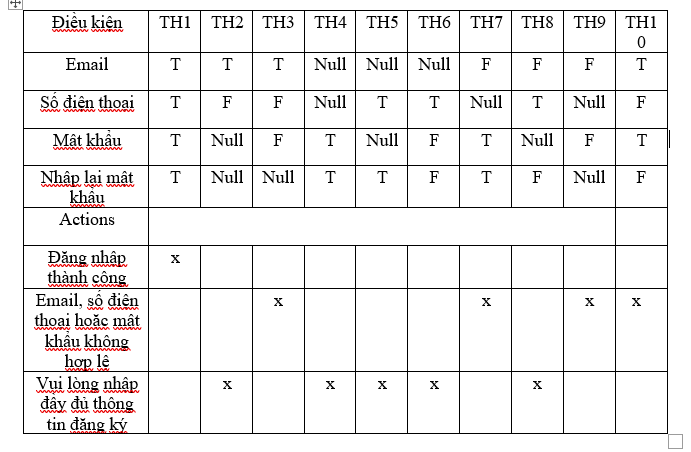
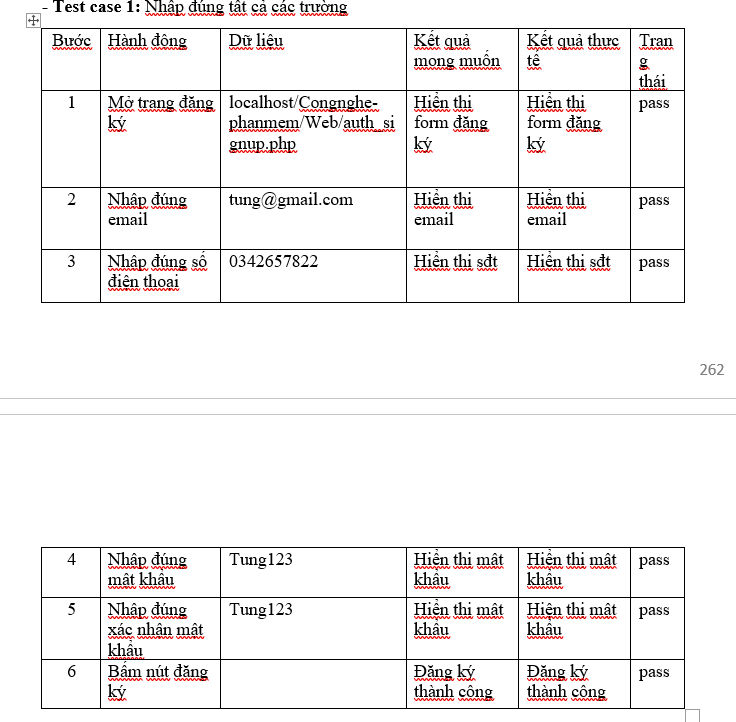
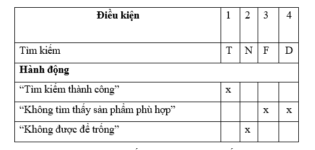
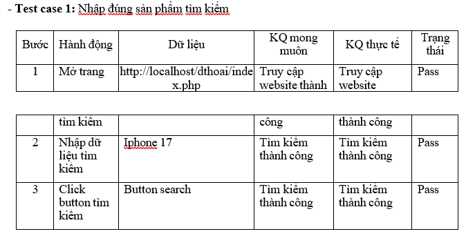

# Testing Documentation

This folder contains testing documentation for the ShopDunk Store Management System.

The testing process includes test design, decision tables, test cases, expected results, actual results, and test status for core system functionalities.

## Login Testing

### Decision Table

### Valid Login Test Case

### Invalid Password Test Case

## Registration Testing

### Decision Table

### Registration Test Case

## Search Testing

### Decision Table

### Search Test Case

